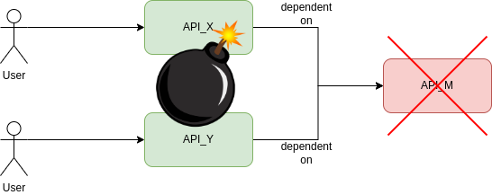
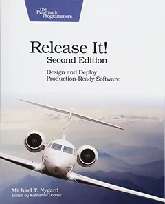
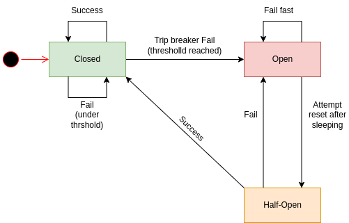
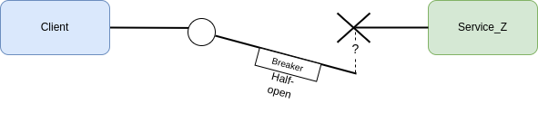

# Circuit Breaker

## Context and Problem
在一個稍微複雜點的系統架構中, 一個服務通常都會有許多的外部依賴項目, 且每個依賴項目都有可能會發生Failure(瘋狂失敗, 短時間內沒有響應, 一直超時, 也可能是網路問題就是).
這網路部份能參考```微服務瞎談(5) CAP理論```[^1]
本來一個請求幾毫秒內能響應回覆, 現在因為發生了Failure, 而導致響應時間增加到10秒.

最前面的調用方們, 可能當下還感受不到某個依賴項目沒在響應了. 而一直持續的發出請求.
  
會導致更嚴重的```CataStrophic casading failure```災難性的級聯故障[^2]
讓系統內更多節點因這一個依賴項目沒響應, 而導致整條鏈路上的多個節點都陷入故障危機.

因此要讓整體變得更加可靠的話, 讓外部依賴變得完全可靠是不可能的.
我們能透過包裝對依賴項目的調用來設計, 並持續監控其故障率.
一旦故障率達到某個門閥值, 就跳閘, 讓調用在```最短時間內響應```故障或錯誤回去.
這設計理念能稱為```fail fast```[^3]

## Solution
Michael Nygard在Release It!該書中[^4], 提到了Circuit Breaker Pattern(斷路器模式)  
  
用來防止調用方重複地去嘗試執行極有可能失敗的遠端操作. 讓調用方停止去等待它並立刻處理失敗的依賴服務不可用的事實.
通過防止單個服務的故障在整個系統中發生級聯故障, Circuit breaker pattern有助於快速恢復整個系統.
Circuit breaker pattern還能自己檢測故障是否已經排除, 如果故障已經被解決, 則會允許調用方可以調用該操作.

## FSM
Circuit breaker算是個proxy, 

Circuit breaker pattern有三種狀態```closed```, ```open```和```half-open```
透過狀態的切換來允許執行的動作, 
- Closed

調用方的請求都能直接去調用; Circuit breaker作為一個代理Proxy, 會負責一定時間內計算失敗次數.

- Open  

調用方的請求會立刻響應錯誤.

> Sleeping window, 這裡的設定是用來給依賴的服務修復的時間用, 以允許調用方再次嘗試調用.

- Half-Open

當circuit breaker處於該狀態下時, 允許級少數的請求, 嘗試去調用, 再根據調用結果決定切換到什麼狀態; 目的就是用來確定所依賴的服務是否恢復可用了.

> Half-open是用來保護依賴服務的, 一個服務正在慢慢恢復時(可能正在暖機建立cache中), 可能能支持的請求量是極其有限的, 要是一堆請求量突然打進去(like 雪崩的發生), 可能又會讓它趴掉了.

# Different from Retry Pattern
Retry pattern是調用方期望它會調用成功.
Circuit breaker pattern則是用來防範可能持續失敗的調用.
兩者是可以相互組合使用的; 但如果breaker已經響應該失敗不是暫時的(像Open), 那就不用再Retry了. 

## References
[^1]: [微服務瞎談(5) CAP理論](https://ithelp.ithome.com.tw/articles/10235541)  
[^2]: [Cascading failure](https://en.wikipedia.org/wiki/Cascading_failure)  
[^3]: [Fail Fast](https://en.wikipedia.org/wiki/Fail-fast)  
[^4]: [Release It!](https://pragprog.com/titles/mnee2/release-it-second-edition/)